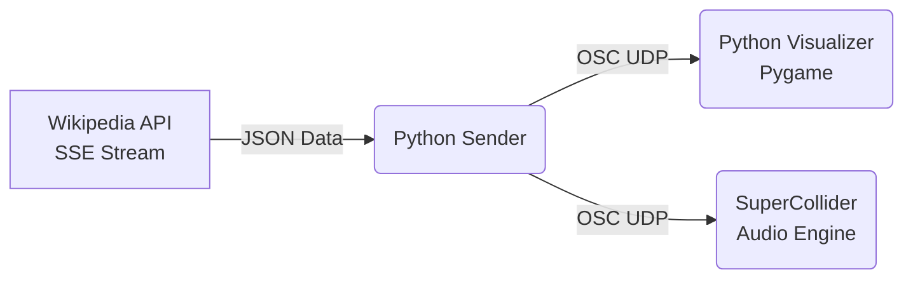

# Generative Sound & Visuals from Wikipedia Streaming

  

A cross-medial generative art installation that transforms the global pulse of human knowledge into a real-time audiovisual experience. This project connects to the live stream of Wikipedia edits, translating abstract data changes into organic soundscapes and dynamic visualizations.

  

---

  

## The Concept & Research

  

Wikipedia is often perceived as a static encyclopedia, but behind the scenes, it is a rapidly changing, living organism. Every second, bots maintain structure, humans add knowledge, and *edit wars* flare up across different languages.

  

This project aims to **sonify and visualize this invisible infrastructure**.

  

By treating the Wikipedia API not just as a data source, but as a **generative seed**, this project explores:

  

-  **Cross-Medial Translation**
How can textual metadata (byte size, user type, language) be translated into sensory inputs (frequency, color, position)?

  

-  **The Sound of Big Data**
Moving away from standard data visualization charts toward an aesthetic, immersive representation of information flow.

  

-  **Human vs. Machine**
Distinct aesthetic signatures for algorithmic bot edits (cold, precise, repetitive) versus human contributions (warm, organic, chaotic).

  

---

  

## System Architecture

  

The system utilizes a modular **Publish–Subscribe architecture** via **OSC (Open Sound Control)** to ensure low-latency communication between components.

  



  

## Components

  

### The Streamer (Python)

Connects to `stream.wikimedia.org`, handles the raw byte-stream, parses JSON events, and broadcasts normalized data packets via UDP.

  

### The Visualizer (Pygame)

Receives OSC data and renders a decaying particle system.

  

### The Sonifier (SuperCollider)

A custom-built FM / subtractive synth engine that generates soundscapes without using pre-recorded samples.

  

---

  

## Generative Mappings

  

The core of the generative aesthetic lies in how data maps to sensory parameters.

  

---

  

### 👁️ Visuals (Pygame)

  

-  **X-Axis**
Represents the language / wiki (e.g. English, German, French).
Each language occupies a distinct vertical band.

  

-  **Y-Axis**
Represents the magnitude of change (delta).
Small typos float near the top; massive rewrites plunge to the bottom.

  

-  **Color Encoding**

	- 🔵 **Blue** — Bot activity (automated tasks)

	- 🟡 **Yellow / Orange** — Human additions

	- 🔴 **Red** — Human deletions (potential vandalism or cleanup)

  

-  **Size**
Proportional to the byte-size change of the edit.

  

---

  

### Audio (SuperCollider)

  

The sound engine uses a **microtonal, frequency-based approach** rather than a fixed MIDI grid, allowing for fluid, organic textures.

  

**Frequency**
Derived from the article title length.
Longer titles generate lower, fundamental frequencies; shorter titles create higher pitches.

  

**Timbre / Synthesis**

- 	**Humans**
Trigger a rich, *SuperSaw*-like subtractive synth with warm sub-bass and resonant filtering.

-  **Bots**
Trigger shorter, sharper, brighter sounds (shifted an octave higher), mimicking digital “chatter”.

  

-  **Duration & Reverb**
Large edits create long, sustaining drones with heavy reverb (using `FreeVerb`), filling the sonic space.

  

---

  

## Installation & Usage

  

### Prerequisites

  

- Python **3.10+**

-  **SuperCollider**

- Python libraries:

```bash

pip install requests python-osc pygame

```

  

### Step 1: Start the Sound Engine

  

1. Open `Wikipedia-Synth.scd` in **SuperCollider**.

2. Boot the server:

```supercollider

Server.default.boot

```

3. Select the entire code block and evaluate it (Ctrl+Enter / Cmd+Enter).

  

The OSC listener is now active on port 57120.

  

### Step 2: Start the Visualizer

  

Open a terminal and run:

  

```bash

python  Wikipedia-Visualizer.py

```

  

A window will open listening on port 57121.

  

### Step 3: Connect to the World

  

Open a second terminal and run:

  

```bash

python  Wikipedia-Streaming.py

```

  

The script connects to the Wikimedia EventStreams API and begins broadcasting data to both the visualizer and SuperCollider.

  

### Project Structure

  

- The data fetcher. Handles HTTP streaming, JSON parsing, and OSC broadcasting.

```bash

Wikipedia-Streaming.py

```

  

- The graphical interface built with Pygame. Handles particle generation and alpha-blending rendering.

```bash

Wikipedia-Visualizer.py

```

  

- The audio synthesis definition. Contains the SynthDef and OSCdef.

```bash

Wikipedia-Synth.scd

```

  

### Future Roadmap

  

-  **3D Visualization**
Porting the visualizer to TouchDesigner or Three.js for a spatial 3D experience.

  

-  **VST Integration**
Routing MIDI data from SuperCollider into a DAW to trigger orchestral libraries.

  

-  **Filtering & Control**
UI controls for filtering specific languages or edit types in real time.

  

### License

  

This project is open-source and available under the **MIT License**.

  

*Created as a research project for the course **“Generative Sound & Visual Art”** at the FH Salzburg.*